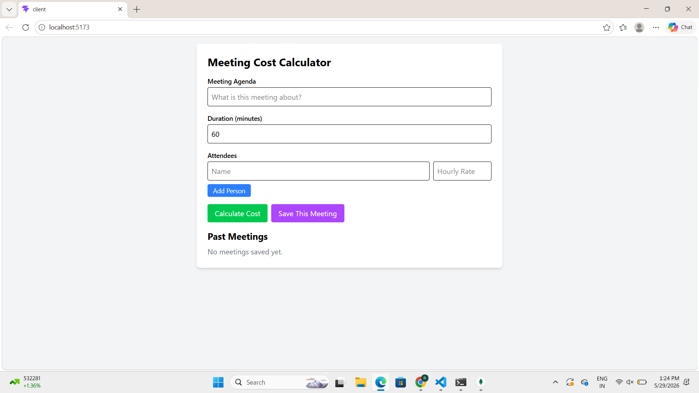
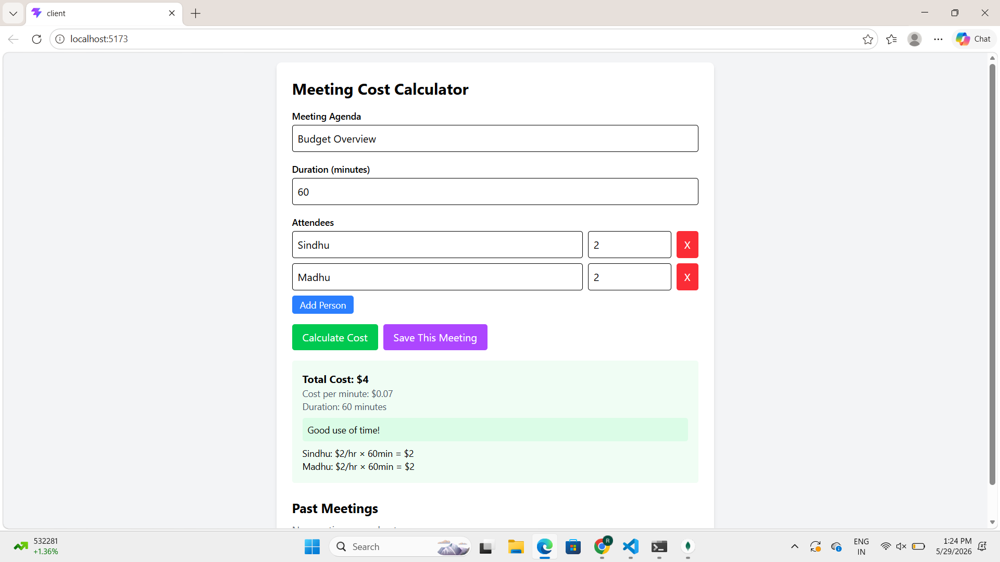
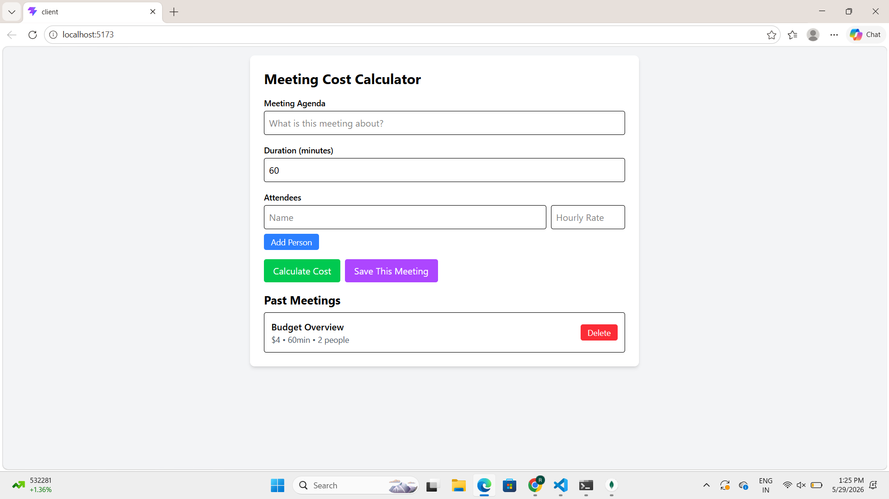

# Meeting Cost Calculator - MERN Stack

[[Node.js](https://img.shields.io/badge/Node.js-18+-green.svg)](https://nodejs.org/)
[[React](https://img.shields.io/badge/React-18-blue.svg)](https://react.dev/)
[[MongoDB](https://img.shields.io/badge/MongoDB-6.0+-green.svg)](https://www.mongodb.com/)

Calculate the real dollar cost of your meetings based on attendee rates and duration. Built with the MERN stack. Save history, get smart cost recommendations, and stop wasting money on unnecessary meetings.

## 📸 Output Screenshots

### **1. Main Calculator View**

*Add agenda, duration, and attendees to calculate real-time cost*

### **2. Cost Breakdown + Recommendation**

*See total cost, cost per minute, and per-person breakdown with color-coded advice*

### **3. Saved Meetings History**

*All saved meetings stored in MongoDB with delete option*

## 📁 Project Structure

InnoMickAssignment/
│
├── Backend/meeting-cost-server/
│   ├── server.js              # Express API + MongoDB models + routes
│   ├── package.json           # Backend dependencies
│   └── .gitignore             # Ignores node_modules, .env
│
├── Frontend/client/
│   ├── public/
│   ├── src/
│   │   ├── App.jsx            # Main React component with all UI logic
│   │   ├── main.jsx           # React entry point
│   │   └── index.css          # Tailwind imports
│   ├── index.html
│   ├── package.json           # Frontend dependencies
│   ├── tailwind.config.js     # Tailwind setup
│   └── .gitignore
│
├── screenshots/               # Add your output images here
│   ├── calculator.png
│   ├── breakdown.png
│   └── past-meetings.png
│
├── .gitignore                 # Root gitignore
└── README.md                  # You are here

## ⚙️ How It Works

### **Data Flow**
1. **User Input**: React collects agenda, duration, and array of `{name, rate}` 
2. **Validation**: Frontend checks for empty people/duration before API call
3. **Calculate API**: `POST /api/meetings/calculate` computes:
   costPerPerson = (hourlyRate / 60) * duration
   total = sum of all costPerPerson
   costPerMin = total / duration
4. **Recommendation Engine**: Backend flags cost as Green ≤$200, Yellow $200-$500, Red >$500
5. **Save to DB**: `POST /api/meetings` stores `{agenda, cost, duration, people_count}` in MongoDB
6. **Fetch History**: `GET /api/meetings` displays all past meetings sorted by newest
7. **Delete**: `DELETE /api/meetings/:id` removes record from DB

### **Key Logic**
```javascript
// Backend calculation
const breakdown = people.map(p => ({
  name: p.name,
  rate: Number(p.rate),
  cost: Number(((p.rate / 60) * duration).toFixed(2))
}));
const total = breakdown.reduce((sum, p) => sum + p.cost, 0);
## 🚀 Quick Start
### *Prerequisites*
- Node.js ≥ 18.x
- MongoDB running locally on `mongodb://localhost:27017`

### *Run Locally*
# Terminal 1 - Backend
cd Backend/meeting-cost-server
npm install
node server.js
# → http://localhost:3001

# Terminal 2 - Frontend  
cd Frontend/meeting-cost-frontend
npm install
npm run dev
# → http://localhost:5173
## 📡 API Reference
Method | Endpoint | Description
`POST` | `/api/meetings/calculate` | Returns cost + breakdown + recommendation
`POST` | `/api/meetings` | Saves meeting to MongoDB
`GET` | `/api/meetings` | Fetches all saved meetings
`DELETE` | `/api/meetings/:id` | Deletes meeting by MongoDB `_id`
## 🔮 Future Enhancements

### *Phase 1 - Core UX*
- [ ] *User Authentication* - JWT login so teams have private meeting history
- [ ] *Team Presets* - Save recurring attendee groups like "Dev Team", "Marketing"
- [ ] *Currency Support* - Toggle between USD, EUR, INR with live conversion
- [ ] *Export Data* - Download past meetings as CSV or PDF reports

### *Phase 2 - Analytics*
- [ ] *Cost Dashboard* - Charts showing total spent per week/month/year
- [ ] *Meeting Efficiency Score* - Track cost vs agenda completion
- [ ] *Calendar Integration* - Pull from Google Calendar, auto-calculate cost
- [ ] *Slack/Teams Bot* - `/meeting-cost` command posts breakdown in channel

### *Phase 3 - Scale*
- [ ] *Docker Compose* - One-command setup: `docker-compose up`
- [ ] *Deploy* - Frontend on Vercel, Backend on Render, DB on MongoDB Atlas
- [ ] *Rate Limiting* - Prevent API abuse
- [ ] *Role-Based Access* - Admin vs Member permissions

### *Nice to Have*
- [ ] Dark mode toggle
- [ ] Meeting timer with live cost ticker
- [ ] Email summary after meeting ends
- [ ] Integration with Zoom/Meet to auto-detect attendees

## 🐛 Troubleshooting
Issue | Fix
`MongooseServerSelectionError` | Run `mongod` or start MongoDB service
`CORS error` | Check backend is on port 3001
`breakdown.map is not a function` | Restart backend, ensure calculate route returns `breakdown: []`
